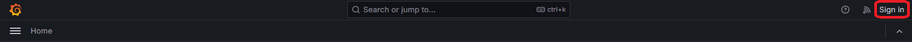
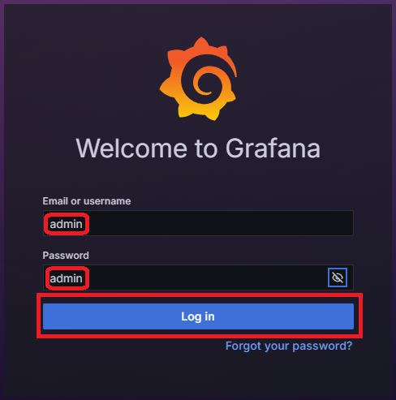
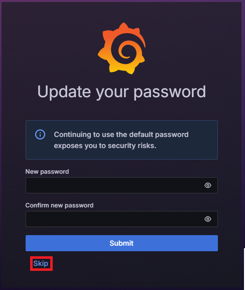
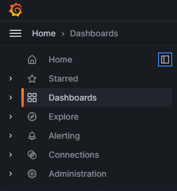
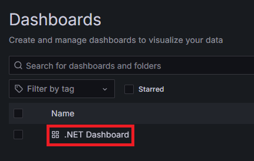
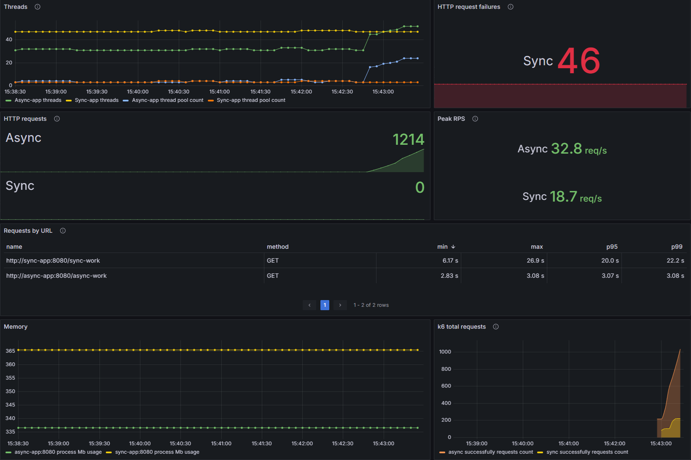

# Сравнение производительности синхронного и асинхронного приложений

Этот проект предназначен для сравнения производительности синхронного и асинхронного приложений на платформе ASP.NET Core с помощью нагрузочного тестирования (k6), мониторинга метрик через Prometheus и визуализации в Grafana. Используются метрики OpenTelemetry для сбора и анализа производительности.

## Содержание
1. [Основные компоненты](#основные-компоненты)
2. [Технологии](#стек-технологий)
3. [Запуск](#запуск)
4. [Нагрузочное тестирование (k6)](#нагрузочное-тестирование)
5. [Примечания](#примечания)

## Основные компоненты

1. **Sync App** — приложение с синхронной обработкой запросов.
2. **Async App** — приложение с асинхронной обработкой запросов.
3. **k6** — инструмент для генерации нагрузочного тестирования.
4. **Prometheus** — система мониторинга и сбора метрик.
5. **Grafana** — визуализация собранных метрик.

## Стек технологий

- **ASP.NET Core**
- **Docker** и **Docker Compose**
- **Prometheus**
- **Grafana**
- **OpenTelemetry** для сбора метрик
- **k6** для нагрузочного тестирования

## Запуск

### Шаг 1: Клонирование репозитория

```bash
git clone https://github.com/VladislavRudakoff/AsyncApocalypse.git
cd AsyncApocalypse
```

### Шаг 2: Построение и запуск контейнеров

```bash
docker-compose up --build
```

После этого будет запущено:
- Синхронное приложение (порт `5000`)
- Асинхронное приложение (порт `5001`)
- Prometheus (порт `9090`)
- Grafana (порт `3000`)
- k6 (для нагрузочного тестирования)

### Шаг 3: Проверка состояния приложений

Оба приложения будут доступны по следующим адресам:

- Синхронное приложение: http://localhost:5000
- Асинхронное приложение: http://localhost:5001

### Шаг 4: Доступ к Grafana

Grafana доступна по адресу http://localhost:3000.

#### 4.1. Вход в аккаунт

Данные для входа:

- Логин: `admin`
- Пароль: `admin`





Можно поменять пароль, но это не обязательно. Лучше просто пропустить этот шаг(`skip`).



#### 4.2. Выбор дашборда



После авторизации откройте заранее настроенный дашборд(`.NET Dashboard`), где можно наблюдать метрики обоих приложений.





## Нагрузочное тестирование

Нагрузочное тестирование автоматически запускается при общем старте файла `docker-compose`, а для отдельного запуска `k6` необходимо выполнить команду:

```bash
docker-compose run k6
```

Скрипт для тестирования(`load_testing.js`) находится в папке `scripts`, и он автоматически начинает выполняться после запуска контейнера `k6`.

## Примечания

- Если необходимо обновить конфигурацию или изменить нагрузочные тесты, отредактируйте файл `load_testing.js` в папке scripts.
- Для просмотра и анализа других метрик можете самостоятельно настроить дополнительные панели в Grafana.
